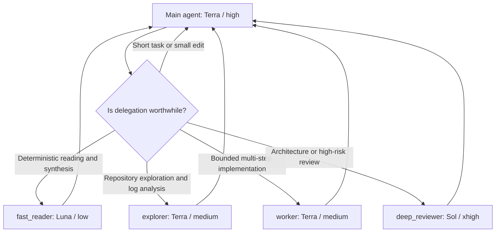

# Codex Adaptive Agent Routing

English | [简体中文](./README.zh-CN.md)

An opinionated multi-model subagent routing template for **Codex App**.
`Terra/high` remains responsible for the main task, while bounded independent
work is proactively delegated to models and reasoning levels that better match
the job. The goal is to preserve completion quality while reducing unnecessary
cost and keeping noisy intermediate work out of the main context.

> This is a community configuration template, not an official OpenAI preset.
> Model names and availability may vary by account, workspace, and product
> version. Confirm that the selected models are available in your Codex App
> before installing.

## Routing overview



| Agent | Default responsibility | Model / reasoning | Access |
| --- | --- | --- | --- |
| Main agent | Understand requirements, identify independent lanes, integrate results, and perform final validation | Terra / high | Current task permissions |
| `fast_reader` | High-volume deterministic extraction, classification, comparison, and summarization | Luna / low | Read-only |
| `explorer` | Multi-file exploration, execution tracing, log analysis, and evidence gathering | Terra / medium | Read-only |
| `worker` | Bounded multi-step implementation with clear acceptance criteria | Terra / medium | Inherits the parent task |
| `deep_reviewer` | High-risk review involving architecture, security, permissions, migrations, or concurrency | Sol / xhigh | Read-only |

The routing policy normally uses at most two subagents and allows up to four only
for genuinely independent read-heavy work. The hard thread cap is six, delegation
depth is limited to one level, and only one write-capable agent may modify a
working tree at a time.

For non-trivial research, diagnosis, multi-file exploration, design analysis,
or feature work, the template first identifies independent lanes. When at least
two read-only lanes can proceed without blocking the critical path, it requires
two to four focused subagents before synthesis. Small, tightly coupled work
stays in the main task.

## Windows quick install

```powershell
git clone https://github.com/ZhangZhengruiNUS/codex-adaptive-agent-routing.git
cd codex-adaptive-agent-routing
Set-ExecutionPolicy -Scope Process Bypass
.\scripts\install.ps1
```

The installer:

- adds the routing policy as a managed block in `~/.codex/AGENTS.md` without
  deleting existing guidance;
- installs four custom agents under `~/.codex/agents/`;
- merges the `Terra/high` defaults and `[agents]` limits into the existing
  `config.toml`;
- merges the experimental `multi_agent_v2` compatibility settings required for
  explicit custom-agent routing metadata;
- preserves existing MCP servers, plugins, project trust entries, and other
  personal settings;
- creates a restore manifest and backup under `~/.codex/backups/`.

Preview the installation without writing files:

```powershell
.\scripts\install.ps1 -WhatIf
```

Install the routing policy and agents without changing the main model or
concurrency settings:

```powershell
.\scripts\install.ps1 -SkipConfig
```

Restart Codex App and start a new task after installation. Verify the result
with:

```powershell
.\scripts\verify.ps1
```

## Verify custom-agent routing

The compatibility settings below are included because they were verified in a
fresh Codex App task on Codex `0.144.2`: a minimal `fast_reader` subagent was
recorded with the configured `gpt-5.6-luna` model instead of inheriting the
parent model.

```toml
[features.multi_agent_v2]
hide_spawn_agent_metadata = false
tool_namespace = "agents"
```

This is an experimental compatibility setting, not a documented stable preset.
After installation, restart Codex App, create a **new** task, and request a
minimal `fast_reader` delegation. Confirm the resulting subagent session record
contains `"model":"gpt-5.6-luna"` before relying on cost-sensitive routing.
If a later Codex release exposes a documented equivalent, prefer that setting.

## Restore the previous configuration

The installer prints the backup directory it created. Restore from that
directory with:

```powershell
.\scripts\restore.ps1 -BackupPath "$HOME\.codex\backups\codex-adaptive-agent-routing-YYYYMMDD-HHMMSS"
```

Restart Codex App and start a new task after restoring.

## Manual installation

1. Add the contents of `templates/AGENTS.md` to `~/.codex/AGENTS.md`.
2. Copy `agents/*.toml` to `~/.codex/agents/`.
3. Merge the model, `[agents]`, and `multi_agent_v2` settings from
   `config.example.toml` into your configuration.
4. Restart Codex App and start a new task.

## Behavior and limitations

- `max_threads` and `max_depth` constrain concurrency and nesting; they do not
  trigger delegation by themselves.
- The template explicitly authorizes bounded delegation and requires parallel
  read-only work when its delegation gate is met. The main agent still judges
  whether lanes are independent, so this is adaptive model-driven routing, not
  a fully deterministic scheduler.
- Each subagent consumes its own model and tool tokens. Keeping small tasks in
  the main task is usually cheaper.
- `multi_agent_v2` is a compatibility layer. Its behavior can change between
  Codex releases, so verify the actual model recorded for a newly spawned agent
  after upgrades.
- The custom `explorer` and `worker` definitions have the same names as built-in
  Codex roles and therefore take precedence. If a project already defines
  agents with these names, rename the template agents and update the routing
  policy accordingly.
- Project-level `.codex/config.toml`, `.codex/agents/`, and closer `AGENTS.md`
  files can still provide project-specific settings and instructions.

## Official references

- [Codex Subagents](https://learn.chatgpt.com/docs/agent-configuration/subagents)
- [AGENTS.md](https://learn.chatgpt.com/docs/agent-configuration/agents-md)
- [Configuration Reference](https://learn.chatgpt.com/docs/config-file/config-reference)
- [Codex Models](https://learn.chatgpt.com/docs/models)

## License

[MIT](./LICENSE)
