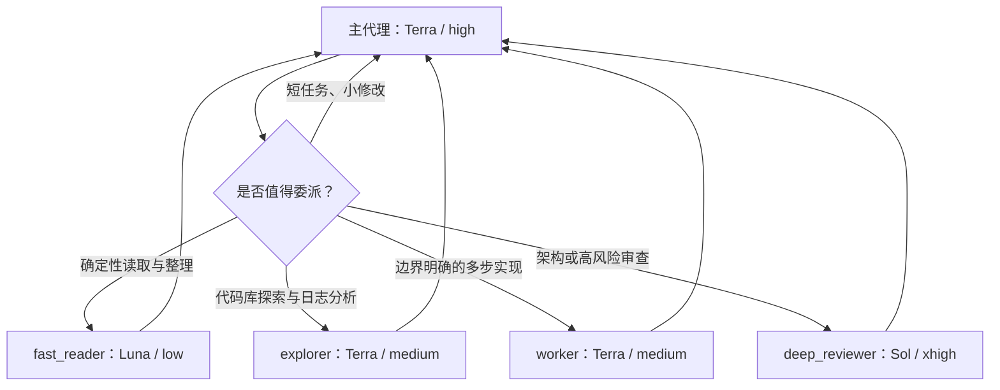

# Codex Adaptive Agent Routing

[English](./README.md) | 简体中文

一套面向 **Codex App** 的多模型子代理路由模板：主任务使用
`Terra/high` 保持整体质量，主动把可独立、边界明确的工作交给更合适的模型和
思考强度，在控制上下文污染与成本的同时保留高风险升级路径。

> 这是社区配置模板，不是 OpenAI 官方预设。模型名称与可用性可能随账号、
> 工作区和产品版本变化，安装前请确认自己的 Codex App 可选模型。

## 路由结构



| 代理 | 默认用途 | 模型 / 思考强度 | 权限 |
| --- | --- | --- | --- |
| 主代理 | 需求理解、识别独立工作线、整合、最终验收 | Terra / high | 当前任务权限 |
| `fast_reader` | 大量但确定性的提取、分类、比较、摘要 | Luna / low | 只读 |
| `explorer` | 多文件探索、调用链、日志与证据收集 | Terra / medium | 只读 |
| `worker` | 边界明确的多步骤实现 | Terra / medium | 继承父任务 |
| `deep_reviewer` | 架构、安全、权限、迁移、并发等高风险审查 | Sol / xhigh | 只读 |

路由策略通常最多使用两个子代理；只有真正独立的只读任务才允许扩展到四个。
线程硬上限为六个，委派深度为一层，同一个工作树同时只允许一个可写代理。

对于非简单的调研、诊断、多文件探索、设计分析或功能任务，模板会先识别独立工作线。
若至少两条只读工作线可以并行推进且不阻塞关键路径，必须在综合前委派两个到四个聚焦
子代理；小型或紧密耦合的工作仍由主任务完成。

## Windows 快速安装

```powershell
git clone https://github.com/ZhangZhengruiNUS/codex-adaptive-agent-routing.git
cd codex-adaptive-agent-routing
Set-ExecutionPolicy -Scope Process Bypass
.\scripts\install.ps1
```

安装器会：

- 把路由规则写入 `~/.codex/AGENTS.md` 的受管区块，不删除已有规则；
- 安装四个 `~/.codex/agents/*.toml` 自定义代理；
- 将 `Terra/high` 与 `[agents]` 限制合并进现有 `config.toml`；
- 合并用于显式自定义代理路由元数据的实验性 `multi_agent_v2` 兼容设置；
- 保留已有 MCP、插件、项目授权和其他个人配置；
- 在 `~/.codex/backups/` 下生成带恢复清单的备份。

先预览而不写入：

```powershell
.\scripts\install.ps1 -WhatIf
```

不修改主模型和并发配置，只安装路由说明与代理：

```powershell
.\scripts\install.ps1 -SkipConfig
```

安装后重启 Codex App，并新建一个任务。验证安装：

```powershell
.\scripts\verify.ps1
```

## 验证自定义代理路由

仓库包含下方兼容设置，是因为它已在 Codex `0.144.2` 的全新 App 任务中通过实测：最小
`fast_reader` 子代理的会话记录使用了配置的 `gpt-5.6-luna`，而非继承父任务模型。

```toml
[features.multi_agent_v2]
hide_spawn_agent_metadata = false
tool_namespace = "agents"
```

这是一项实验性兼容设置，不是官方已文档化的稳定预设。安装后请重启 Codex App，**新建**任务，
并请求一次最小 `fast_reader` 委派；确认生成的子代理会话记录包含
`"model":"gpt-5.6-luna"`，再将它用于成本敏感的路由。如果后续 Codex 版本提供了
正式的等价设置，应优先采用正式设置。

## 恢复安装前状态

安装命令会输出备份目录。使用对应目录恢复：

```powershell
.\scripts\restore.ps1 -BackupPath "$HOME\.codex\backups\codex-adaptive-agent-routing-YYYYMMDD-HHMMSS"
```

恢复后同样需要重启 Codex App，并新建任务。

## 手动安装

1. 将 `templates/AGENTS.md` 内容加入 `~/.codex/AGENTS.md`。
2. 将 `agents/*.toml` 复制到 `~/.codex/agents/`。
3. 参考 `config.example.toml` 合并模型、`[agents]` 与 `multi_agent_v2` 配置。
4. 重启 Codex App，并新建任务。

## 行为边界

- `max_threads` 和 `max_depth` 只限制并发与嵌套，不会单独触发委派。
- 模板显式授权有边界的委派，并在满足委派门槛时要求并行只读工作。主代理仍会判断
  工作线是否独立，因此这是基于模型判断的自适应路由，而不是完全确定性的调度器。
- 子代理会独立消耗模型与工具 token；小任务不委派通常更省。
- `multi_agent_v2` 是兼容层；其行为可能随 Codex 版本改变。升级后请在新建任务中核验
  新产生子代理记录的实际模型。
- `explorer` 和 `worker` 与 Codex 内置角色同名，自定义定义会优先。若项目已有
  同名自定义代理，建议重命名本模板中的 `name` 并同步修改路由规则。
- 项目级 `.codex/config.toml`、`.codex/agents/` 和更近的 `AGENTS.md` 仍可提供
  项目专属设置与指令。

## 官方资料

- [Codex Subagents](https://learn.chatgpt.com/docs/agent-configuration/subagents)
- [AGENTS.md](https://learn.chatgpt.com/docs/agent-configuration/agents-md)
- [Configuration Reference](https://learn.chatgpt.com/docs/config-file/config-reference)
- [Codex Models](https://learn.chatgpt.com/docs/models)

## 许可证

[MIT](./LICENSE)
